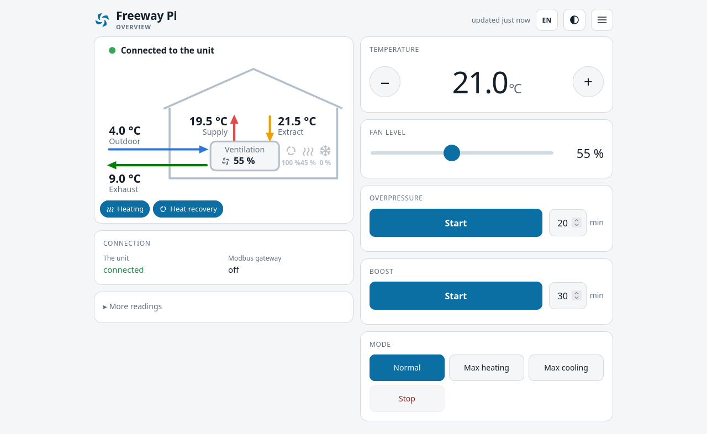
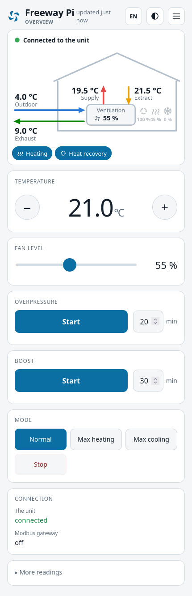

# Freeway Pi

A replacement for the Enervent/Exvent **Freeway WEB** bus adapter, built on a
Raspberry Pi.

It does the two things the original does, and aims to do both better:

- a **Modbus TCP gateway** to the ventilation unit's RS-485 bus, so Home
  Assistant, Homey and anything else you already point at the old adapter keeps
  working unchanged;
- a **web interface** that works on a phone, for the things people actually
  change — temperature, fan level, boost — plus the settings, timer programmes,
  graphs and alarms the original keeps behind a slower page.

No account, no cloud, no app. It is a box on your own network that answers when
you open it.

<p align="center">
  
</p>
<p align="center">
  
</p>
<p align="center">
  <em>The overview, in a browser and on a phone. Every reading shown is from the
  simulated unit in <code>demo/</code> — run <code>go run ./demo</code> to open
  the interface yourself, with no Raspberry Pi and no cable.</em>
</p>

> **Status:** in daily use. Everything described here has been measured and run
> on one unit — an Exvent/Enervent **PRO greenair HP** with EDA software version
> 558 — and on nothing else. Other EDA-board units are very likely to work; none
> has been tried.

## Getting one running

1. **Flash the image** to a memory card with whatever you use — Raspberry Pi
   Imager, balenaEtcher, `dd`. Nothing about the image needs a particular tool.
   If Raspberry Pi Imager offers to apply its own settings (wifi, user name,
   ssh key), say no: they are not used. `freeway.txt`, below, does the same job
   and works whichever tool wrote the card.
2. **If the Pi will be on wifi**, write a file called `freeway.txt` on the card's
   boot partition before you take it out. That partition is FAT, so any laptop
   can write it:

   ```
   wifi-ssid=MyNetwork
   wifi-psk=a good long passphrase
   wifi-country=NO
   ```

   On a wired connection you can skip this entirely.
3. **Connect the adapter**: a USB RS-485 adapter to the Pi, and its A/B pair to
   the ventilation unit's adapter connector on the motherboard.
4. **Power it on.** It comes up at `http://freeway.local`, or at whatever
   address your router hands it.

The first page asks you to pick a PIN. That PIN guards the settings, the timer
programmes and the system page — not the everyday controls, which anybody in the
house can reach without knowing anything.

### Cable or wifi

A cable is the better answer for a box that has to answer a wall panel and a
home-automation hub for years. But a ventilation unit does not always stand
where an ethernet socket does, so wifi works, and it can be set up from the
System page as well as from the card.

Both at once is fine and is worth doing: the Pi keeps its wired address, and if
the cable is ever lost it moves to the wireless one by itself. The hostname
follows it either way, which is why pointing Modbus clients at the name rather
than the address is worth the minute it takes.

## When something is wrong

The card is the way back in when there is no way in — a wifi network that has
changed, or a box that will not answer. Take it out, put it in any laptop, and
write `freeway.txt` on the boot partition:

```
wifi-ssid=MyNetwork         join a different network
wifi-psk=a good long passphrase
wifi-country=NO
timezone=Europe/Oslo        the box's own timezone
ssh=30                      open the ssh port for thirty minutes
ssh-key=<the whole line from your id_ed25519.pub>
ssh-user=yourname           rename the login account
pin=1234                    set a new PIN, no old one needed
```

On the next boot it is read, acted on, and **deleted** — replaced by
`freeway.txt.done`, which says what happened and which address the box ended up
on, and carries neither the passphrase nor the PIN.

Requiring the card is the whole of the security model here, and it is the right
one: whoever is holding it already has everything on it.

## What is on the box

The image is Raspberry Pi OS Lite with Freeway Pi installed and closed down: a
firewall that answers on the web interface, Modbus and mDNS and drops the rest,
and the services a ventilation controller has no use for switched off.

**Ssh is closed** on a fresh image, and key-only when it is open: no password
login at all, and the image ships with no key. Most people never need it. If
you do, add a public key on the System page and open the port there — for half
an hour, or for good — or put both on the card:

```
ssh-key=<the whole line from your id_ed25519.pub>
ssh=30
```

The login account is **`fwadmin`**, so `ssh fwadmin@freeway.local` once a key is
in and the port is open. `ssh-user=` on the card renames it if you would rather
it were yours. It has `sudo` without a password on purpose: it has no password
at all, and the only way in is a key you put there yourself.

The card is also the way back in if the web interface itself stops answering:
it is read at boot, before Freeway Pi starts, and does not need it running.

Updates install themselves. Security updates apply unattended; the System page
shows what is pending and will install the rest on request.

## How it works

`freewayd` is a single static Go binary. It owns the serial port, polls the unit
on a schedule, and everything else — the web interface, the Modbus TCP gateway,
the history database — reads from that one snapshot rather than competing for
the bus. There is no runtime, no package manager and no build step in the
browser.

Anything that needs root — changing the network, installing updates, rebooting —
goes through a small helper service over a unix socket. The daemon itself runs
unprivileged and cannot become root.

Every risky change arms its own undo before it applies. Change the address, lose
the box, and it comes back on the old settings by itself; pull the power instead
and it still comes back, because the undo survives a reboot.

There is more in [docs/architecture.md](docs/architecture.md), and what we have
worked out about the unit's own registers is in
[docs/eda-registers.md](docs/eda-registers.md).

## Hardware

- A Raspberry Pi. It runs on a Pi 2 Model B and upwards; images are built for
  both 32-bit and 64-bit.
- A USB RS-485 adapter. An FTDI one is what this was developed against.
- The ventilation unit's adapter connector — the same one the Freeway WEB used.

## Tested against

The Modbus TCP gateway has been tested with the Homey app
[Allram/com.fladby.exvent](https://github.com/Allram/com.fladby.exvent), which
talks to the unit the same way the original adapter's clients do. Anything else
that speaks Modbus TCP should work; nothing else has been tried.

## How this was built

Written with [Claude Code](https://claude.com/claude-code). The reasoning
behind most decisions is in the comments, next to the code it explains.

## What this is not

Not affiliated with, endorsed by, or supported by Enervent or Exvent. *Freeway*,
*Enervent*, *Exvent* and the unit model names are their owners' marks, used here
only to say what this works with.

It writes to your ventilation unit — setpoint, fan level, mode, timer
programmes and the unit's clock — over the same bus the original adapter uses.
Nothing here writes outside the ranges the unit itself reports, and every write
is one the unit's own panel can make. It is still software that controls
household ventilation, it has been tried on one unit, and it comes with no
warranty of any kind. If your unit is under warranty or a service contract,
check what they say about third-party equipment on the bus before you connect
it.

## Licence

Copyright (C) 2026 Magnus Fonn Tømte.

GPL-3.0-or-later. The full text is in `LICENSE`.

Free to use, change and pass on. Anyone who distributes it, for money or not,
has to hand on the source under the same terms — so a closed product cannot be
built from it, while somebody setting one up for a neighbour can still charge
for the Raspberry Pi and their time.

Nothing it is built from constrains the choice: every dependency is
BSD-3-Clause or MIT.
Those notices are in `THIRD-PARTY.md`, along with uPlot's, which is vendored
here and whose MIT terms require its notice to travel with it.

The authoritative register list is Enervent's own document. It is not reproduced
here; [docs/eda-registers.md](docs/eda-registers.md) records what we established
by measurement.
